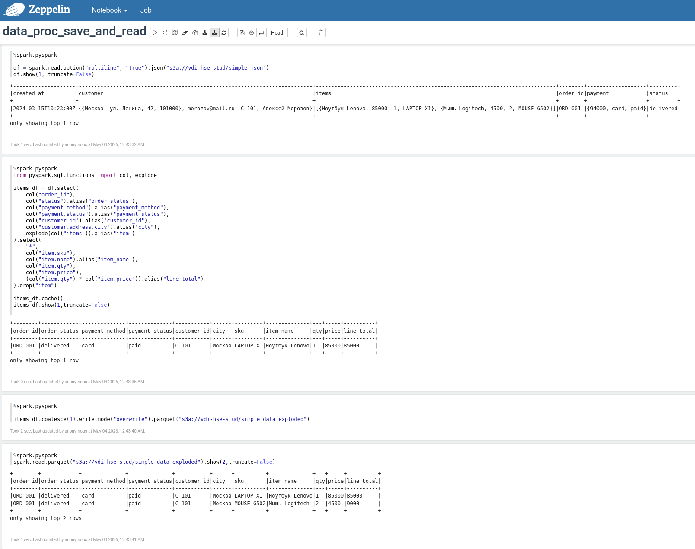
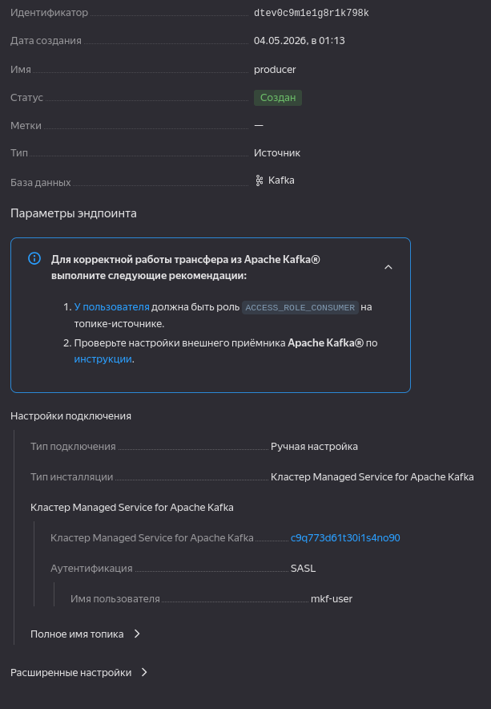
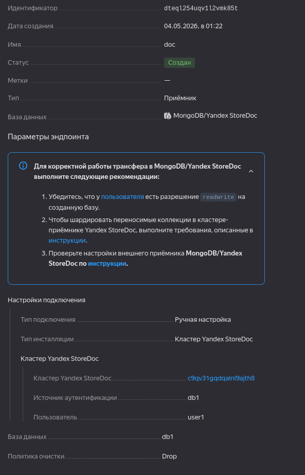
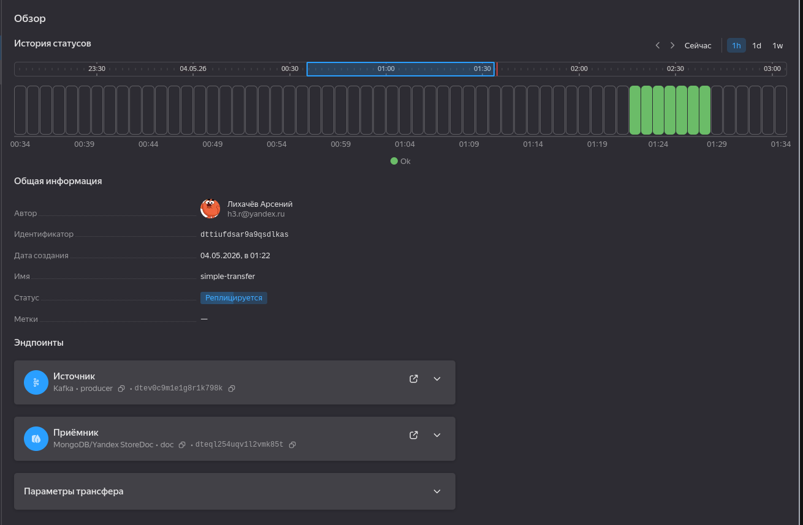
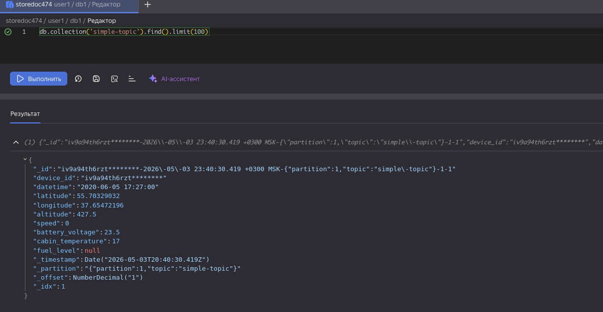

# Задание 4. NoSQL и работа с big data

## Обработка даных в Yandex Data Processing 

Создал файл с данными для обработки - [тут](./simple.json)

В нем лежат данные заказов интернет магазина.

Положил их в bucket на Object Storage, затем прочитал, обработал, записал в тот же бакет в parquet формате

Ноутбук с кодом обработки - [тут](data_proc_save_and_read.ipynb)

## Data Transfer

Создал продьюсер и эндпойнт под него 

 

Создал консьюмер и экндпойнт под него

Активировал трансфер

Проверил таблицу в StoreDoc

